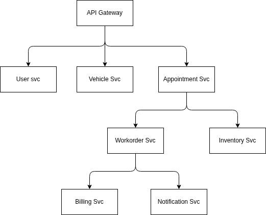

# Car Clinic Application

## Overview

The Car Clinic application helps car owners and clinic staff manage vehicle maintenance. Customers can schedule service appointments, view service history, and receive updates about their vehicles. Clinic staff can manage customers, vehicles, appointments, services, parts, and vehicle status, while sending important notifications to customers.

### Backend Architecture

The backend is implemented as a set of independently deployable microservices, with an API Gateway providing a single entry point for client requests. The services are responsible for user, vehicle, appointment, work order, inventory, billing, and notification functionality. Each service can own the business logic and data for its area, while communicating with the other services as needed to support the clinic's workflows. The services are built with Spring Boot and use Spring Data JPA, PostgreSQL, request validation, OAuth2 bearer tokens issued by Keycloak, and OpenAPI documentation.

The architecture is illustrated below:

**Backend technologies:** Java 21, Spring Boot, Spring MVC, Spring Data JPA, PostgreSQL, Keycloak, OAuth2 Resource Server, and OpenAPI.

### Frontend Architecture